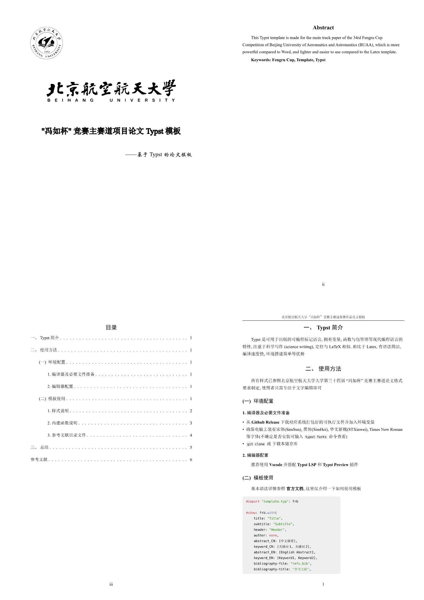

# BUAA FRB Template

This Typst template is made for the main track paper of the 34rd Fengru Cup Competition of Beijing University of Aeronautics and Astronautics (BUAA), which is more powerful compared to Word, and lighter and easier to use compared to the Latex template.

~~Made this template just because the fxxking Word fxxk me up! :(~~

## Preview



# Typst Overview

Typst is a new markup-based typesetting system for the sciences. It is designed to be an alternative both to advanced tools like LaTeX and simpler tools like Word and Google Docs.

# Usage

All styles have been modelled after the Latex template of the main track paper of the 34th Fengru Cup competition at Beijing University of Aeronautics and Astronautics (BUAA), so users only need to focus on editing the text.

## Environment

### Compiler and necessary files

- Download the Compiler for your system from [**Github Release**](https://github.com/typst/typst/releases/) add it to the PATH environment variable
- Make sure your computer has the following fonts: SimSun (宋体), SimHei (黑体), STXinwei(华文新魏), Times New Roman (If you're not sure you can check by entering the following command: `typst fonts`)
- `git clone` or download this repository

### Editor

Recommend *Vscode* with the **Typst LSP** plugin and **Typst Preview** plugin

## Use this template

For details of the basic syntax, refer to [**Typst Docs**](https://typst.app/docs/reference). You can also check out this [Example](./main.typ). Here is just a brief description of how to use the template

```typ
#import "template.typ": frb

#show: frb.with(
    title: "Title",
    subtitle: "Subtitle",
    header: "Header",
    author: none,
    abstract-CN: [中文摘要],
    keyword-CN: [关键词1, 关键词2],
    abstract-EN: [English Abstract],
    keyword-EN: [Keyword1, Keyword2],
    bibliography-file: "refs.bib",
    bibliography-title: "Reference",
    bibliography-style: "gb-7714-2015-numeric",
    auto-num-title: true,
)
= First title

== Second title

=== Third title

Your article
```

- `title`: title of the paper, displayed on the cover page, mandatory
- `subtitle`: subtitle of the paper, can be left blank, no need to manually write out dashes
- `header`: content of the header of the paper
- `author`: the author is added even though it should be left blank or `none` according to the Fengru Cup rule.
- `abstract-CN`: Chinese abstract, just put it in brackets, the content is the same as the main text, the same as the following `abstract-EN`.
- `keyword-CN`: Chinese keyword, fill in the middle bracket directly, separated by comma, the same as the following `keyword-EN`
- `bibliography-file`: the bibliography file is a `.bib` file, see below and `refs.bib` in the root of the repository
- `bibliography-title`: Bibliography Page title
- `bibliography-style`: Bibliography style
- `auto-num-title`: auto numbering title according to Fengru Cup's specification, enabled by default, you can also disable this feature to manually number the titles if you need to.

### Styling instructions

For level 1, 2, 3 headings, the template has been adapted to the corresponding styles.

The template has been made to automatically indent at the beginning of a paragraph, so you only need to enter a blank line as a subparagraph.

However, Typst only indents the first line of consecutive paragraphs except for the first paragraph, so elements that break the continuity of a paragraph will cause the indentation to fail.

This template adapts automatic indentation for the following elements:

- Heading
- List
- Numbered list
- Table
- Math block
- Code block
- `img` function

For other elements, indentation can be added manually via `#indent` or `#h(2em)`.

For math blocks and code blocks, the fonts are built-in, if you need to replace them, please modify the template code directly.

Currently Typst's support for Chinese font styles is not perfect, so the template provides some functions to assist, including the `bold` function for bold text, the `italic` function to make the text italicised, as well as versions specifically for Chinese characters, if you want to be able to achieve the Chinese font boldness through the native syntax, you can enable the global rule with `#show: bold-rule`, and italic is the same, but there may be some conflicts and hard-to-trace errors.

PS: `bold` function may conflict with a function of the same name in the Maths block, which can be resolved by aliasing the import.

### Built-in Functions

Only the most basic usage is shown, see the template source code for details.

- `img`: Add a image with caption
    - usage: `#img(path:"path/to/image")[caption]`
    - alternate arg:
        - `width`: Use of percentages
        - `num`: Whether to add serial number automatically, off by default
- The following functions are for non-English characters
- `bold`: Bold words
    - usage: `#bold[Text]`
    - alternate arg:
        - `reg`: Regular expression
        - `base-weight`: Font weight
- `bold-cn`: Bold Chinese words, the same as `bold`
- `bold-rule`: Enables you to bold text with `**`
    - usage: `#show: bold-rule`
- `bold-cn-rule`
- `italic`: Italicise the text
    - usage: `#italic[Text]`
    - alternate arg:
        - `reg`: Regular expression
        - `ang`: Angle of inclination, radian system
        - `spacing`: Both sides blank
- `italic-rule`: Enables you to Italicise text with `__`
    - usage: `#show: italic-rule`

### Bibliography File

A `.bib` file usually contains several entries as follows

```bib
@article{refa,
    author    = {Author},
    title     = {Title},
    journal   = {Journal},
    volume    = {1},
    pages     = {1--2},
    year      = {2024},
}

@book{refb,
    author    = {Author},
    title     = {Title},
    edition   = {Edition},
    address   = {Address},
    publisher = {Publisher},
    year      = {2024},
}

@phdthesis{refp,
    author = {Author},
    title  = {Title},
    school = {School},
    year   = {2024},
}
```

These are articles, books, and doctoral theses. The `refa` etc. represent the name of the citation, which can be added to the text at a specific place by `@refa`. The other parameters are easy to understand. Finally, the bibliography is added at the end of the article. For other parameters and types, please refer to the LaTex BibTex standard.

---

- The fake bold / fake italic function refers to the following content
  - [Typst Chinese Community](https://typst-doc-cn.github.io/docs/chinese/)
  - The [cuti](https://github.com/csimide/cuti/) package
  - Typst Issue [#2749](https://github.com/typst/typst/issues/2749)
- The BUAA logo is from [https://github.com/THN-BUAA/BUAA-Logo](https://github.com/THN-BUAA/BUAA-Logo)